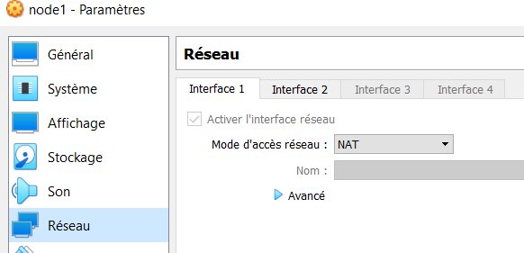
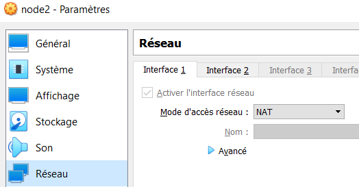
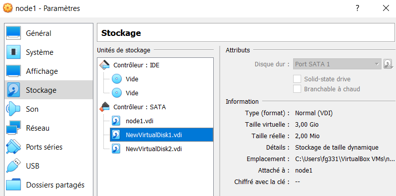

# TP1 : (re)Familiaration avec un système GNU/Linux

## 0. Préparation de la machine  

### Accès internet (via la carte NAT) :  
 - node1 :  
 Configuration interface  
   
 Ping internet  
 ```
 [root@node1 fg331]# ping 1.1.1.1

PING 1.1.1.1 (1.1.1.1) 56(84) bytes of data.
64 bytes from 1.1.1.1: icmp_seq=2 ttl=54 time=21.0 ms
64 bytes from 1.1.1.1: icmp_seq=3 ttl=54 time=23.8 ms
64 bytes from 1.1.1.1: icmp_seq=4 ttl=54 time=21.5 ms
64 bytes from 1.1.1.1: icmp_seq=5 ttl=54 time=20.9 ms
 ```

 - node2 :  
 Configuration interface  
   
 Ping internet  
 ```
 [root@node2 fg331]# ping 1.1.1.1
PING 1.1.1.1 (1.1.1.1) 56(84) bytes of data.
64 bytes from 1.1.1.1: icmp_seq=1 ttl=54 time=28.0 ms
64 bytes from 1.1.1.1: icmp_seq=2 ttl=54 time=20.8 ms
64 bytes from 1.1.1.1: icmp_seq=3 ttl=54 time=21.2 ms
64 bytes from 1.1.1.1: icmp_seq=4 ttl=54 time=22.0 ms
 ```
 
### Les machines doivent avoir un nom

 - node1 :
 ```
 [root@node1 fg331]# hostname
 node1.tp1.b2
 ```
 - node2 :
 ```
 [root@node2 fg331]# hostname
 node2.tp1.b2
 ```

### Utiliser 1.1.1.1 comme serveur DNS

  - node1 :  
  ```
  [root@node1 fg331]# dig ynov.com

; <<>> DiG 9.16.23-RH <<>> ynov.com
;; global options: +cmd
;; Got answer:
;; ->>HEADER<<- opcode: QUERY, status: NOERROR, id: 38790
;; flags: qr rd ra; QUERY: 1, ANSWER: 3, AUTHORITY: 0, ADDITIONAL: 1

;; OPT PSEUDOSECTION:
; EDNS: version: 0, flags:; udp: 1232
;; QUESTION SECTION:
;ynov.com.                      IN      A

;; ANSWER SECTION:
ynov.com.               13      IN      A       104.26.11.233
ynov.com.               13      IN      A       104.26.10.233
ynov.com.               13      IN      A       172.67.74.226

;; Query time: 24 msec
;; SERVER: 1.1.1.1#53(1.1.1.1)
;; WHEN: Mon Nov 14 12:27:36 CET 2022
;; MSG SIZE  rcvd: 85
  ```
  La réponse :  
  ```
  ;; ANSWER SECTION:
ynov.com.               13      IN      A       104.26.11.233
ynov.com.               13      IN      A       104.26.10.233
ynov.com.               13      IN      A       172.67.74.226
  ```
  Le serveur qui a répondu :  
  ```
  ;; SERVER: 1.1.1.1#53(1.1.1.1)
  ```

  - node2 :  
  ```
  [root@node2 fg331]# dig ynov.com

; <<>> DiG 9.16.23-RH <<>> ynov.com
;; global options: +cmd
;; Got answer:
;; ->>HEADER<<- opcode: QUERY, status: NOERROR, id: 22681
;; flags: qr rd ra; QUERY: 1, ANSWER: 3, AUTHORITY: 0, ADDITIONAL: 1

;; OPT PSEUDOSECTION:
; EDNS: version: 0, flags:; udp: 1232
;; QUESTION SECTION:
;ynov.com.                      IN      A

;; ANSWER SECTION:
ynov.com.               300     IN      A       104.26.10.233
ynov.com.               300     IN      A       104.26.11.233
ynov.com.               300     IN      A       172.67.74.226

;; Query time: 25 msec
;; SERVER: 1.1.1.1#53(1.1.1.1)
;; WHEN: Mon Nov 14 12:25:50 CET 2022
;; MSG SIZE  rcvd: 85
  ```
  La réponse :  
  ```
  ;; ANSWER SECTION:
ynov.com.               13      IN      A       104.26.11.233
ynov.com.               13      IN      A       104.26.10.233
ynov.com.               13      IN      A       172.67.74.226
  ```
  Le serveur qui a répondu :   
  ```
  ;; SERVER: 1.1.1.1#53(1.1.1.1)
  ```

### Les machines doivent pouvoir se joindre par leurs noms respectifs

 - node1 :  
 Ajout de la ligne dans le fichier /etc/hosts pour ping node2 en utilisant node2 ou node2.tp1.b2
    ```
    [root@node1 fg331]# cat /etc/hosts
    127.0.0.1   localhost localhost.localdomain localhost4 localhost4.localdomain4
    ::1         localhost localhost.localdomain localhost6 localhost6.localdomain6
    10.101.1.12 node2 node2.tp1.b2
    ```
    ping :
    ```
    [root@node1 fg331]# ping node2
    PING node2 (10.101.1.12) 56(84) bytes of data.
    64 bytes from node2 (10.101.1.12): icmp_seq=1 ttl=64 time=0.735 ms
    64 bytes from node2 (10.101.1.12): icmp_seq=2 ttl=64 time=0.706 ms
    ```
    ```
    [root@node1 fg331]# ping node2.tp1.b2

    PING node2 (10.101.1.12) 56(84) bytes of data.
    64 bytes from node2 (10.101.1.12): icmp_seq=1 ttl=64 time=0.368 ms
    64 bytes from node2 (10.101.1.12): icmp_seq=2 ttl=64 time=0.717 ms
    ```

 - node2 :  
 Ajout de la ligne dans le fichier /etc/hosts pour ping node1 en utilisant node1 ou node1.tp1.b2
    ```
    [root@node2 fg331]# cat /etc/hosts
    127.0.0.1   localhost localhost.localdomain localhost4 localhost4.localdomain4
    ::1         localhost localhost.localdomain localhost6 localhost6.localdomain6
    10.101.1.11 node1 node1.tp1.b2
    ```
    ping :
    ```
    [root@node2 fg331]# ping node1
    PING node1 (10.101.1.11) 56(84) bytes of data.
    64 bytes from node1 (10.101.1.11): icmp_seq=1 ttl=64 time=0.350 ms
    64 bytes from node1 (10.101.1.11): icmp_seq=2 ttl=64 time=0.469 ms
    64 bytes from node1 (10.101.1.11): icmp_seq=3 ttl=64 time=0.660 ms
    ```
    ```
    [root@node2 fg331]# ping node1.tp1.b2
    PING node1 (10.101.1.11) 56(84) bytes of data.
    64 bytes from node1 (10.101.1.11): icmp_seq=1 ttl=64 time=0.412 ms
    64 bytes from node1 (10.101.1.11): icmp_seq=2 ttl=64 time=0.554 ms
    64 bytes from node1 (10.101.1.11): icmp_seq=3 ttl=64 time=0.417 ms
    ```

## I. Utilisateur

### 1. Création et configuration  

 - Ajout utilisateur :  
   - node1 :  
   ```
   [root@node1 fg331]# useradd -m -d /home/coco1 -s /bin/bash coco1
   ```
   - node2 :  
   ```
   [root@node2 fg331]# useradd -m -d /home/coco2 -s /bin/bash coco2
   ```

   Preuve en regardant le fichier /etc/passwd :  
    - node1 :  
    ```
    [root@node1 fg331]# cat /etc/passwd

    coco1:x:1001:1001::/home/coco1:/bin/bash
    ```
    - node2 :  
    ```
    [root@node1 fg331]# cat /etc/passwd

    coco2:x:1001:1001::/home/coco2:/bin/bash
    ```
 - Créer un nouveau groupe "admins"  
    ```
    [root@node1 fg331]# groupadd admins
    ```
    ```
    [root@node2 fg331]# groupadd admins
    ```
    - Don des droits root au groupe admins :  
    ```
    [root@node1 fg331]# cat /etc/sudoers

    ## Allows people in group wheel to run all commands
    %wheel  ALL=(ALL)       ALL
    %admins ALL=(ALL)       ALL
    ```
    ```
    [root@node2 fg331]# cat /etc/sudoers
    
    ## Allows people in group wheel to run all commands
    %wheel  ALL=(ALL)       ALL
    %admins ALL=(ALL)       ALL
    ```
 - Ajouter votre utilisateur à ce groupe admins :  
    ```
    [root@node1 fg331]# usermod -aG admins coco1
    ```
    ```
    [root@node2 fg331]# usermod -aG admins coco1
    ```
    Preuve que le nouvel user à maintenant les droits sudo :  
    ```
    [coco1@node1 fg331]$ sudo -l
    Matching Defaults entries for coco1 on node1:
        !visiblepw, always_set_home, match_group_by_gid, always_query_group_plugin, env_reset,
        env_keep="COLORS DISPLAY HOSTNAME HISTSIZE KDEDIR LS_COLORS", env_keep+="MAIL PS1 PS2
        QTDIR USERNAME LANG LC_ADDRESS LC_CTYPE", env_keep+="LC_COLLATE LC_IDENTIFICATION
        LC_MEASUREMENT LC_MESSAGES", env_keep+="LC_MONETARY LC_NAME LC_NUMERIC LC_PAPER
        LC_TELEPHONE", env_keep+="LC_TIME LC_ALL LANGUAGE LINGUAS _XKB_CHARSET XAUTHORITY",
        secure_path=/sbin\:/bin\:/usr/sbin\:/usr/bin

    User coco1 may run the following commands on node1:
        (ALL) ALL
    ```

### 2.SSH
 - Les clefs sont déjà présente (manip effectué l'année dernière id_ed25519 pour la privé et id_ed25519.pub pour la public) :  
  ```
  fg331@LAPTOP-VI1KK0CA MINGW64 ~/.ssh
$ ls
config  id_ed25519  id_ed25519.pub  known_hosts  known_hosts.old
  ```
 - Assurer vous que la connexion SSH est fonctionnelle  
   - node1 (connexion ssh sur l'utilisateur coco1):  
 ```
 fg331@LAPTOP-VI1KK0CA MINGW64 ~/.ssh
$ ssh-copy-id coco1@10.101.1.11
/usr/bin/ssh-copy-id: INFO: Source of key(s) to be installed: "/c/Users/fg331/.ssh/id_ed25519.pub"
/usr/bin/ssh-copy-id: INFO: attempting to log in with the new key(s), to filter out any that are already installed
/usr/bin/ssh-copy-id: INFO: 1 key(s) remain to be installed -- if you are prompted now it is to install the new keys
coco1@10.101.1.11's password:

Number of key(s) added: 1

Now try logging into the machine, with:   "ssh 'coco1@10.101.1.11'"
and check to make sure that only the key(s) you wanted were added.


fg331@LAPTOP-VI1KK0CA MINGW64 ~/.ssh
$ ssh coco1@10.101.1.11
Last login: Mon Nov 14 16:20:51 2022
[coco1@node1 ~]$ dqzdqz
 ```
   - node2 (connexion ssh sur l'utilisateur coco2):  
 ```
 fg331@LAPTOP-VI1KK0CA MINGW64 ~/.ssh
$ ssh-copy-id coco2@10.101.1.12
/usr/bin/ssh-copy-id: INFO: Source of key(s) to be installed: "/c/Users/fg331/.ssh/id_ed25519.pub"
/usr/bin/ssh-copy-id: INFO: attempting to log in with the new key(s), to filter out any that are already installed
/usr/bin/ssh-copy-id: INFO: 1 key(s) remain to be installed -- if you are prompted now it is to install the new keys
coco2@10.101.1.12's password:

Number of key(s) added: 1

Now try logging into the machine, with:   "ssh 'coco2@10.101.1.12'"
and check to make sure that only the key(s) you wanted were added.


fg331@LAPTOP-VI1KK0CA MINGW64 ~/.ssh
$ ssh coco2@10.101.1.12
Last login: Mon Nov 14 16:21:45 2022
[coco2@node1 ~]$ dqzdqz
 ```

## II. Partitionnement  

### 1. Préparation de la VM, ajout de 2 disques dur de 3 Go    

### 2. Partionnement  

Les 2 disques en Physical Volume :  
```
[coco1@node1 ~]$ sudo lsblk
[sudo] password for coco1:
NAME        MAJ:MIN RM  SIZE RO TYPE MOUNTPOINTS
sda           8:0    0    8G  0 disk
├─sda1        8:1    0    1G  0 part /boot
└─sda2        8:2    0    7G  0 part
  ├─rl-root 253:0    0  6.2G  0 lvm  /
  └─rl-swap 253:1    0  820M  0 lvm  [SWAP]
sdb           8:16   0    3G  0 disk
sdc           8:32   0    3G  0 disk
sr0          11:0    1 1024M  0 rom
sr1          11:1    1 1024M  0 rom

[coco1@node1 ~]$ sudo pvcreate /dev/sdb
  Physical volume "/dev/sdb" successfully created.

[coco1@node1 ~]$ sudo pvcreate /dev/sdc
  Physical volume "/dev/sdc" successfully created.
```

- Agréger les 2 disques en 1 seul Volume Group  
  ```
  [coco1@node1 ~]$ sudo vgcreate cocodata /dev/sdb
  [sudo] password for coco1:
    Volume group "cocodata" successfully created
  

  [coco1@node1 ~]$ sudo vgextend cocodata /dev/sdc
    Volume group "cocodata" successfully extended

  [coco1@node1 ~]$ sudo vgs
    Devices file sys_wwid t10.ATA_____VBOX_HARDDISK___________________________VBda24c3b0-a010b9b7_ PVID fHsJgEIyJhn3b4mu46iLMV8M1OS1IshN last seen on /dev/sda2 not found.
    VG       #PV #LV #SN Attr   VSize VFree
    cocodata   2   0   0 wz--n- 5.99g 5.99g
  ```
- Créer 3 logical volumes de 1 Go chacun  
  ```
  [coco1@node1 ~]$ sudo lvcreate -L 1G cocodata -n cocodata1
  [sudo] password for coco1:
    Logical volume "cocodata1" created.

  [coco1@node1 ~]$ sudo lvcreate -L 1G cocodata -n cocodata2
    Logical volume "cocodata2" created.

  [coco1@node1 ~]$ sudo lvcreate -L 1G cocodata -n cocodata3
    Logical volume "cocodata3" created.
  ```
- Formater ces partitions en ext4  
  ```
  [coco1@node1 ~]$ sudo mkfs -t ext4 /dev/cocodata/cocodata1
  mke2fs 1.46.5 (30-Dec-2021)
  Creating filesystem with 262144 4k blocks and 65536 inodes
  Filesystem UUID: 90b56ed8-c97b-4bc5-9a18-369c0d8bee17
  Superblock backups stored on blocks:
          32768, 98304, 163840, 229376

  Allocating group tables: done
  Writing inode tables: done
  Creating journal (8192 blocks): done
  Writing superblocks and filesystem accounting information: done


  [coco1@node1 ~]$ sudo mkfs -t ext4 /dev/cocodata/cocodata2
  mke2fs 1.46.5 (30-Dec-2021)
  Creating filesystem with 262144 4k blocks and 65536 inodes
  Filesystem UUID: 3a8c8643-1cd2-4777-95b7-e74692df5d04
  Superblock backups stored on blocks:
          32768, 98304, 163840, 229376

  Allocating group tables: done
  Writing inode tables: done
  Creating journal (8192 blocks): done
  Writing superblocks and filesystem accounting information: done


  [coco1@node1 ~]$ sudo mkfs -t ext4 /dev/cocodata/cocodata3
  mke2fs 1.46.5 (30-Dec-2021)
  Creating filesystem with 262144 4k blocks and 65536 inodes
  Filesystem UUID: 8f142539-f61d-4067-9376-229bf3a0a2d8
  Superblock backups stored on blocks:
          32768, 98304, 163840, 229376

  Allocating group tables: done
  Writing inode tables: done
  Creating journal (8192 blocks): done
  Writing superblocks and filesystem accounting information: done
  ```

- Monter ces partitions pour qu'elles soient accessibles aux points de montage /mnt/part1 , /mnt/part2 et /mnt/part3  
  ```
  [coco1@node1 ~]$ sudo mkdir /mnt/part1
  [coco1@node1 ~]$ sudo mount /dev/cocodata/cocodata1 /mnt/part1

  [coco1@node1 ~]$ sudo mkdir /mnt/part2
  [coco1@node1 ~]$ sudo mount /dev/cocodata/cocodata2 /mnt/part2

  [coco1@node1 ~]$ sudo mkdir /mnt/part3
  [coco1@node1 ~]$ sudo mount /dev/cocodata/cocodata3 /mnt/part3


  [coco1@node1 ~]$ df -h
  Filesystem                      Size  Used Avail Use% Mounted on
  devtmpfs                        462M     0  462M   0% /dev
  tmpfs                           481M     0  481M   0% /dev/shm
  tmpfs                           193M  3.0M  190M   2% /run
  /dev/mapper/rl-root             6.2G  1.2G  5.1G  18% /
  /dev/sda1                      1014M  210M  805M  21% /boot
  tmpfs                            97M     0   97M   0% /run/user/1001
  /dev/mapper/cocodata-cocodata1  974M   24K  907M   1% /mnt/part1
  /dev/mapper/cocodata-cocodata2  974M   24K  907M   1% /mnt/part2
  /dev/mapper/cocodata-cocodata3  974M   24K  907M   1% /mnt/part3
  ```

### Grâce au fichier /etc/fstab , faites en sorte que cette partition soit montée automatiquement au démarrage du système  

  - Ajout des lignes suitantes :  
    ```
    /dev/cocodata/cocodata1     /mnt/part1                  ext4    defaults        0 0
    /dev/cocodata/cocodata2     /mnt/part2                  ext4    defaults        0 0
    /dev/cocodata/cocodata3     /mnt/part3                  ext4    defaults        0 0
    
    ```
    au fichier /etc/fstab

    ```
    [coco1@node1 ~]$ sudo cat /etc/fstab
    #
    # /etc/fstab
    # Created by anaconda on Fri Sep 30 08:34:33 2022
    #
    # Accessible filesystems, by reference, are maintained under '/dev/disk/'.
    # See man pages fstab(5), findfs(8), mount(8) and/or blkid(8) for more info.
    #
    # After editing this file, run 'systemctl daemon-reload' to update systemd
    # units generated from this file.
    #
    /dev/mapper/rl-root     /                       xfs     defaults        0 0
    UUID=501bc6c7-ffe9-4eae-9d4f-63c0ffc6ba82 /boot                   xfs     defaults        0 0
    /dev/mapper/rl-swap     none                    swap    defaults        0 0
    /dev/cocodata/cocodata1     /mnt/part1                  ext4    defaults        0 0
    /dev/cocodata/cocodata2     /mnt/part2                  ext4    defaults        0 0
    /dev/cocodata/cocodata3     /mnt/part3                  ext4    defaults        0 0
    ```

## Gestion de services 

### 1. Interaction avec un service existant

 -  Assurez-vous que ...  
 L'unité est démarrée  
    ```
    [coco1@node1 ~]$ sudo systemctl status firewalld
    ● firewalld.service - firewalld - dynamic firewall daemon
        Loaded: loaded (/usr/lib/systemd/system/firewalld.service; enabled; vendor preset: enabled)
        Active: active (running) since Mon 2022-11-14 22:08:25 CET; 49s ago
          Docs: man:firewalld(1)
      Main PID: 800 (firewalld)
          Tasks: 2 (limit: 5907)
        Memory: 41.8M
            CPU: 326ms
        CGroup: /system.slice/firewalld.service
                └─800 /usr/bin/python3 -s /usr/sbin/firewalld --nofork --nopid

    Nov 14 22:08:25 node1.tp1.b2 systemd[1]: Starting firewalld - dynamic firewall daemon...
    Nov 14 22:08:25 node1.tp1.b2 systemd[1]: Started firewalld - dynamic firewall daemon.
    ```

    L'unité est activé  
    ```
    [coco1@node1 ~]$ sudo systemctl is-enabled firewalld

    enabled
    ```
### A. Unité simpliste 

 - Création du fichier /etc/systemd/system/web.service  
  ```
  [coco1@node1 ~]$ cat /etc/systemd/system/web.service

  [Unit]
  Description=Very simple web service

  [Service]
  ExecStart=/usr/bin/python3 -m http.server 8888

  [Install]
  WantedBy=multi-user.target
  ```
  - Ouverture du port 8888 :  
  ```
  [coco1@node1 ~]$ sudo firewall-cmd --add-port=8888/tcp --permanent
  success
  ```
 - Accès au serveur web :  
 ```
 fg331@LAPTOP-VI1KK0CA MINGW64 ~
$ curl 10.101.1.11:8888

  % Total    % Received % Xferd  Average Speed   Time    Time     Time  Current
                                 Dload  Upload   Total   Spent    Left  Speed
100   975  100   975    0     0   244k      0 --:--:-- --:--:-- --:--:--  317k<!DOCTYPE HTML PUBLIC "-//W3C//DTD HTML 4.01//EN" "http://www.w3.org/TR/html4/strict.dtd">
<html>
<head>
<meta http-equiv="Content-Type" content="text/html; charset=utf-8">
<title>Directory listing for /</title>
</head>
<body>
<h1>Directory listing for /</h1>
<hr>
<ul>
<li><a href="afs/">afs/</a></li>
<li><a href="bin/">bin@</a></li>
<li><a href="boot/">boot/</a></li>
<li><a href="dev/">dev/</a></li>
<li><a href="etc/">etc/</a></li>
<li><a href="home/">home/</a></li>
<li><a href="lib/">lib@</a></li>
<li><a href="lib64/">lib64@</a></li>
<li><a href="media/">media/</a></li>
<li><a href="mnt/">mnt/</a></li>
<li><a href="opt/">opt/</a></li>
<li><a href="proc/">proc/</a></li>
<li><a href="root/">root/</a></li>
<li><a href="run/">run/</a></li>
<li><a href="sbin/">sbin@</a></li>
<li><a href="srv/">srv/</a></li>
<li><a href="sys/">sys/</a></li>
<li><a href="tmp/">tmp/</a></li>
<li><a href="usr/">usr/</a></li>
<li><a href="var/">var/</a></li>
</ul>
<hr>
</body>
</html>
 ``` 

### B. Modification de l'unité  

 - Préparer l'environnement pour exécuter le mini serveur web python  
 ```
[coco1@node1 ~]$ sudo useradd web

[coco1@node1 ~]$ sudo mkdir /var/www
[coco1@node1 ~]$ sudo mkdir /var/www/meow/

[coco1@node1 www]$ cd /var/www/
[coco1@node1 www]$ sudo chown web meow
[coco1@node1 www]$ sudo cd meow
[coco1@node1 meow]$ sudo su web
[web@node1 meow]$ touch test

[web@node1 meow]$ ls -al
total 0
drwxr-xr-x. 2 web  root 18 Nov 15 00:12 .
drwxr-xr-x. 3 root root 18 Nov 15 00:10 ..
-rw-rw-r--. 1 web  web   0 Nov 15 00:12 test
 ```

- Modifier l'unité de service :  
```
[coco1@node1 meow]$ cat /etc/systemd/system/web.service

[Unit]
Description=Very simple web service

[Service]
ExecStart=/usr/bin/python3 -m http.server 8888
User=web
WorkingDirectory=/var/www/meow/

[Install]
WantedBy=multi-user.target
```

- Vérifier le bon fonctionnement  
```
fg331@LAPTOP-VI1KK0CA MINGW64 ~
$ curl 10.101.1.11:8888
  % Total    % Received % Xferd  Average Speed   Time    Time     Time  Current
                                 Dload  Upload   Total   Spent    Left  Speed
100   330  100   330    0     0   111k      0 --:--:-- --:--:-- --:--:--  161k<!DOCTYPE HTML PUBLIC "-//W3C//DTD HTML 4.01//EN" "http://www.w3.org/TR/html4/strict.dtd">
<html>
<head>
<meta http-equiv="Content-Type" content="text/html; charset=utf-8">
<title>Directory listing for /</title>
</head>
<body>
<h1>Directory listing for /</h1>
<hr>
<ul>
<li><a href="test">test</a></li>
</ul>
<hr>
</body>
</html>
```